## les1.无线传输方案
1、无线传输方案比较
（1）WIFI：“Wi-Fi”常被写成“WiFi”或“Wifi”，无线局域网技术
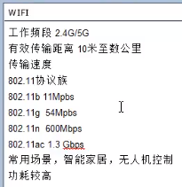

（2）NFC 近场通信技术
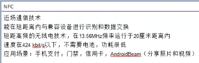

（3）Bluetooth 蓝牙
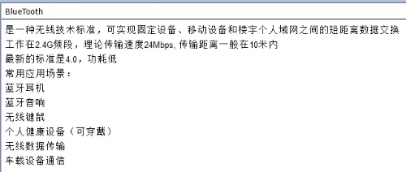

（4）总结：比较连接方式、使用距离、速度、功耗对比
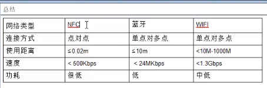

2、蓝牙的工作流程
扫描 -> 配对 -> 传输数据
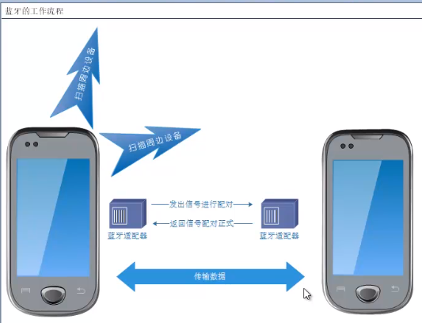

## les2. 蓝牙基础操作
1、添加权限
<uses-permission android:name="android.permission.BLUETOOTH"/>
<uses-permission android:name="android.permission.BLUETOOTH_ADMIN"/>

<uses-permission android:name="android.permission.ACCESS_COARSE_LOCATION" />
<uses-permission android:name="android.permission.ACCESS_FINE_LOCATION" />

2、基础操作
BluetoothAdapter 本机的蓝牙适配器
BluetoothDevice 远程的蓝牙适配器

（1）判断是否支持蓝牙
BluetoothAdapter mAdapter = BluetoothAdapter.getDefaultAdapter();
boolean isSupportBlueTooth = mAdapter != null;

（2）蓝牙开关
isEnabled()

人机交互方式
Intent intent = new Intent(BluetoothAdapter.ACTION_REQUEST_ENABLE);
activity.startActivityForResult(intent, requestCode);
//收到结果，对应的在onActivityResult()方法知道是否成功打开蓝牙
RESULT_OK
RESULT_CANCELED

自动方式
enabled
disabled

（3）通过监听器来监听操作结果
广播
IntentFilter filter = new IntentFilter();
filter.addAction(BluetoothAdapter.Action_STATE_Changed);
registerReceiver(receiver0, filter);

//看广播的各种状态回调
private BroadcastReceiver receiver0 = new BroadcastReceiver() {
        @Override
        public void onReceive(Context context, Intent intent) {
            int state = intent.getIntExtra(BluetoothAdapter.EXTRA_STATE,  -1);
            switch (state) {
                case BluetoothAdapter.STATE_OFF://关闭
                    Toast.makeText(MainActivity.this, "STATE_OFF", Toast.LENGTH_SHORT).show();
                    break;
                case BluetoothAdapter.STATE_ON://打开
                    Toast.makeText(MainActivity.this, "STATE_ON", Toast.LENGTH_SHORT).show();
                    break;
                case BluetoothAdapter.STATE_TURNING_ON://正在打开
                    Toast.makeText(MainActivity.this, "STATE_TURNING_ON", Toast.LENGTH_SHORT).show();
                    break;
                case BluetoothAdapter.STATE_TURNING_OFF://关闭
                    Toast.makeText(MainActivity.this, "STATE_TURNING_OFF", Toast.LENGTH_SHORT).show();
                    break;
                default:
                    Toast.makeText(MainActivity.this, "STATE_UNKNOWN", Toast.LENGTH_SHORT).show();
                    break;
            }
        }
    };

## les3. 蓝牙操作
(1)查找设备
mAdapter.startDiscovery(); //是个异步函数
查找设备的时间大概是12s

//当设备A去查找周边设备时，周边设备B即使蓝牙是打开的，可见性为不可见，也是找不到它的
//所以，要打开蓝牙可见性
//会弹出询问对话框，是否允许可见
public void enableVisibily(Context context){
    Intent intent = new Intent(BluetoothAdapter.ACTION_REQUEST_DISCOVERABLE);
    intent.putExtra(BluetoothAdapter.EXTRA_DISCOVERABLE_DURATION,300); //300s，设备可见的时间300s
    context.startActivity(intent);
}

（2）//查找设备广播监听
//注册这个广播，系统没找到一个设备，就会发一个广播过来
filter.addAction(BluetoothDevice.ACTION_FOUND);

if(BluetoothDevice.ACTION_FOUND.equals(action)) {
    BluetoothDevice device = intent.getParcelableExtra(BluetoothDevice.EXTRA_DEVICE);
    //找到一个添加一个
    mDeviceList.add(device);
    mAdapter.notifyDataSetChanged();
}

（3）绑定
BluetoothDevice device = mDeviceList.get(i);
if (Build.VERSION.SDK_INT >= Build.VERSION_CODES.KITKAT) {//19即4.4。 只有4.4以上才支持程序绑定
    device.createBond();
}
绑定设备，在程序里面绑定设备，需要更高的权限
BLUETOOTH_ADMIN
需要在android4.4才可以。

##  les4 蓝牙连接

通用socket的连接流程
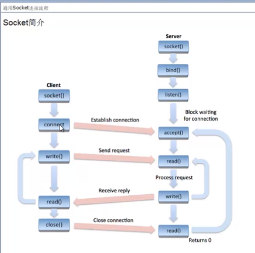
上面的通用的socket流程。
在蓝牙连接中，客户端的也是一样；  
但是服务端不一样，是没有bind()\listen()两步骤的，
而是在accept()这里，是阻塞的。一接收就连接上了。上面通用的socket listen是阻塞的。

当有连接时，调用accept()，会重新创建一个socket。
也就是可以连接多个设备的。

（1）创建连接之服务端
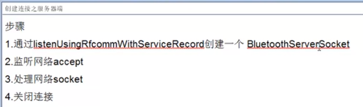

（2）创建连接之客户端
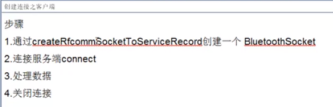

通用socket连接流程
创建连接之服务端
创建连接之客户端
数据通讯示例

//服务端
// MY_UUID是应用程序的UUID，客户端代码使用相同的UUID
BluetoothServerSocket tmp = mBluetoothAdapter.listenUsingRfcommWithServiceRecord(NAME, MY_UUID);
通过listenUsingRfcommWithServiceRecord创建一个BluetoothServerSocket；
监听网络accept
处理网络socket
关闭连接

// MY_UUID是应用程序的UUID，客户端代码使用相同的UUID
BluetoothSocket tmp = device.createRfcommSocketToServiceRecord(MY_UUID);
通过createRfcommSocketToServiceRecord创建一个BluetoothSocket
连接服务端connect
处理数据
关闭连接

两端必须先绑定，才能连接、通讯。

## les5 蓝牙规范
Bluetooth Profile
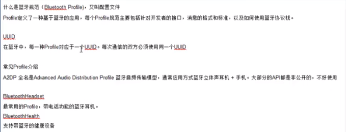

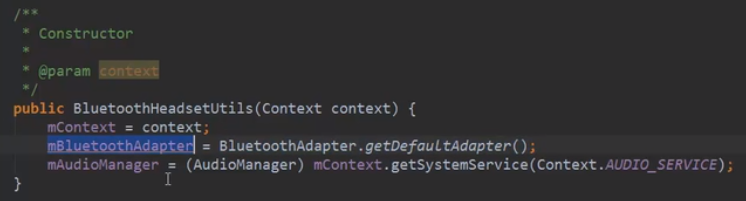
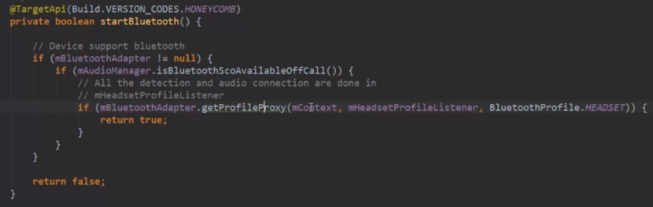

mController.getAdapter().getProfileProxy(this, new BluetoothProfile.ServiceListener() {
    @Override
    public void onServiceConnected(int i, BluetoothProfile bluetoothProfile) {

    }

    @Override
    public void onServiceDisconnected(int i) {

    }
}, BluetoothProfile.HEADSET);

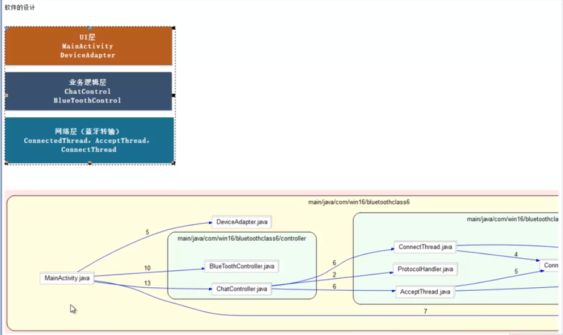

